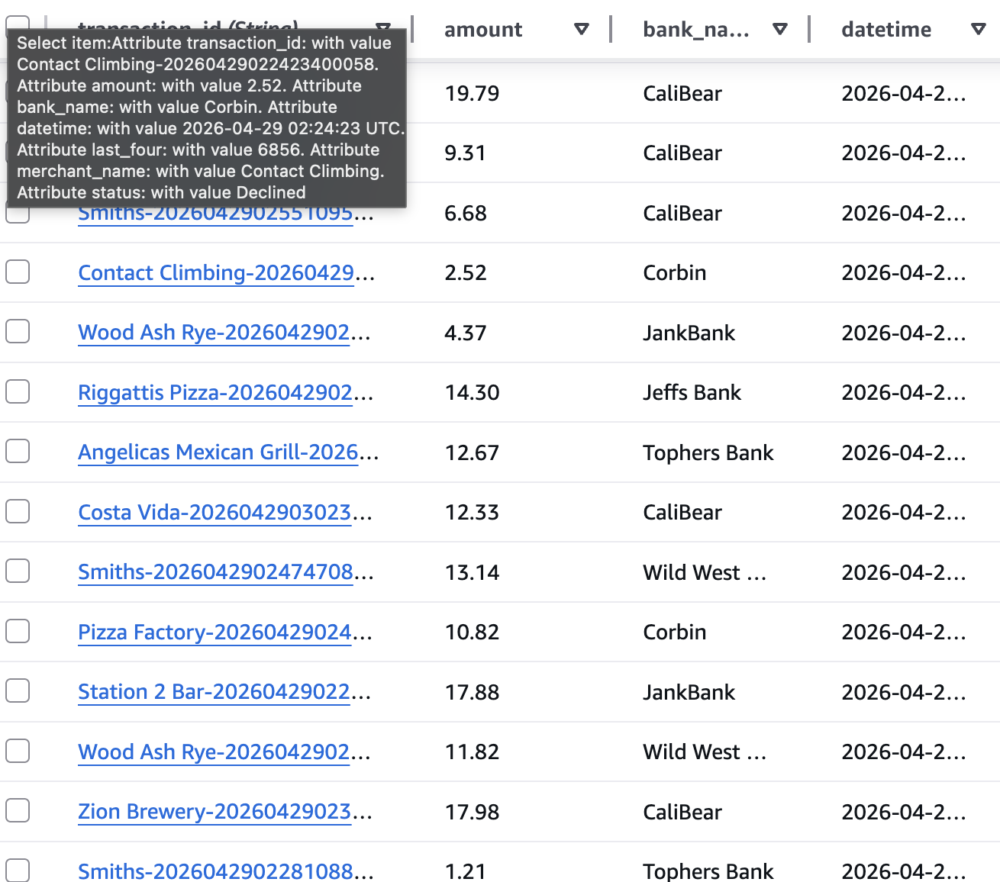

# Credit Card Clearinghouse

A serverless credit card processing system built on AWS Lambda and DynamoDB. The system acts as a clearinghouse between point-of-sale merchants and multiple bank APIs — authenticating merchants, routing transactions to the correct bank, normalizing each bank's response, and writing an immutable transaction log to DynamoDB. It integrates with six independent banks, each with different authentication styles and field schemas, and exposes a single unified endpoint that any registered merchant can call to process a debit, credit, or deposit transaction.

The project was built as a semester-long software engineering exercise, going from requirements and database design through a fully deployed cloud API with a CI/CD pipeline. Every push to main automatically deploys to a staging Lambda alias, runs an automated test suite, and only promotes to production if all tests pass.

